**Project Description**  
Codify is a full-stack web application inspired by LeetCode, designed to provide a platform for programmers to practice and improve their coding skills. It offers features like:

- **Remote Code Execution:** Users can write code in a secure code editor, submit it for execution, and receive results and verdicts.
- **Custom Test Cases:** Users can create and run their own test cases to validate their code's functionality.
- **Language Support:** Currently supports Python and C++.
- **Submission Storage:** Submitted code, verdicts, and user information are stored in the database for future reference.
- **Concurrent Request Handling:** Employs Bull Queue based on Redis to efficiently manage numerous concurrent requests.

**Technologies Used**

- **Frontend:** React JS, Redux Toolkit, Monaco Editor
- **Backend:** Node.js, Express.js, MongoDB
- **Authentication:** JWT
- **Message Queue:** Bull Queue (Redis)

**Getting Started**

**Prerequisites:**

- Node.js and npm (or yarn) installed
- MongoDB database

**Backend Setup:**

1. Clone the repository: `git clone https://github.com/RajSahu1331/Judge.git`
2. Navigate to the backend directory: `cd server`
3. Install dependencies: `npm install`
4. Start the server: `nodemon app.js`

**Frontend Setup:**

1. Navigate to the frontend directory: `cd client`
2. Install dependencies: `npm install`
3. Start the development server: `npm run dev`

**Usage**

- Access the application in your browser (default: [http://localhost:3000](http://localhost:3000)).
- Sign up or log in using JWT authentication.
- Choose a programming language (currently Python or C++).
- Write your code in the code editor.
- Create and run custom test cases (optional).
- Click "Submit" to execute the code and receive results and verdict.

  **Design Diagram**

**Additional Notes**

- For detailed instructions and usage examples, refer to the project's documentation or code comments.
- Feel free to contribute to the project by creating pull requests.

**Future Enhancements**

- Considering adding support for more programming languages.
- Implementing more advanced features like code optimization suggestions and plagiarism detection.
- Explore containerization and deployment options for scalability using Docker and AWS Lambda Instance.
